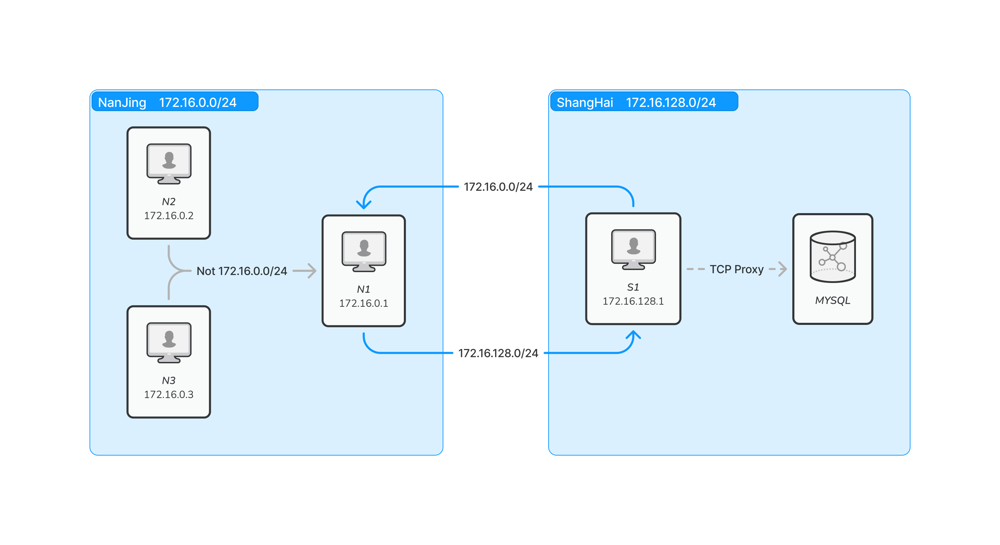

# 搭建在 wireguard 上的 kubernetes

我在公网搭建了一个 Kubernetes 集群(详见[《国内自建 Kubernetes 指南》](./4.国内自建Kubernetes指南.md))。本是为了省云服务器的钱，但是却发现在公网搭建产生了不少流量费（约每天 5 块钱）。经过一番检查，发现是由于原本内网调用就能完成的请求都被放入了公网，产生了许多本不应该产生的流量费。

目前，我的 Kubernetes 集群中三台核心的 Worker 和 Master 都在南京，用于部署应用程序。
一台极低配置的 Worker 放在上海做 Tcp 代理，主要是贪图上海极其廉价的数据库服务。

我决定使用 wireguard 将不同地区的主机组成一个虚拟局域网，并配置使其优先使用内网。
并在虚拟局域网基础上搭建 Kubernetes，从而最大程度上减少公网流量。

> - 为什么核心的 Worker 和 Master 在南京？
>
>   因为离家更近延迟非常低。偶尔部署游戏服务玩很方便。
>   饥荒的延迟能低至 10ms，和好兄弟玩游戏像是在电脑本地玩一样。
>
> - 上海数据库服务多便宜？
>
>   上海阿里云提供 300 块钱 3 年的廉价 MySQL 数据使用。
>   比在 Kubernetes 上自建 MySQL 服务还要便宜很多。
>   然而南京并不提供此类产品购买。

## 架构

我这里选择使用 B 类网段(172.16.0.0/12)构建虚拟局域网。
并将 172.16.0.0/24 分配给南京，172.16.128.0/24 分配给上海。

> - 网段是什么？
>
>   网段是一指一个 IP 地址范围。例如 172.16.0.0/12 表示从 172.16.0.0 到 172.31.255.255 之间的所有 IP 地址。
>
> - 为何选择 B 类网段？
>
>   C 类网段(192.168.0.0/16)往往被用于家庭局域网。
>   A 类网段又被我用于 Kubernetes。为避免冲突选择了 B 类网段。
>
> - 如何在阿里云/腾讯云设置内网 IP 地址
>
>   阿里云中可以手动创建*专有网络*；腾讯云可以手动创建*私有网络*。
>   阿里云和腾讯云只是命名不一样，并且都是免费的。



南京三台主机分别编号：N1(172.16.0.1)、N2(172.16.0.2)、N3(172.16.0.3)；
上海一台主机编号：S1(172.16.128.1)。

N1、N2 与 N3 之间的请求会通过内网完成（示例图中未标注内网请求）。N2 和 N3 需将 172.16.0.0/12 网段中排除 172.16.0.0/24 之外的请求转发给 N1 处理。N1 和 S1 之间将对方网段的数据通过公网转发给对方处理。

> 为什么要 从 172.16.0.0/12 网段中排除 172.16.0.0/24?
>
> N2/N3 不需要将 172.16.0.0/24(南京网段) 的流量转发给 N1 处理。
> N2 可以直接访问到 N1 和 N3！

这样以来，绝大多数的网络请求都会在南京区域的内网完成，只有数据库请求和 S1 的监控数据需要通过公网发送。

> 从南京连接上海的数据库延迟是否太高？
>
> 是的，大约有 100-200ms 延迟，这对于很多高大上的业务系统来讲是无法忍受的。
> 但是我现在一无所有，100 块一年的数据库对我来说实在是太香了。
> 有人会疑惑在上海额外放一台主机是否更费钱。
> 其实，这台上海的主机是我大学时期脑壳一热买了特别特别长时间的一台
> 2C2G 的主机。现在也算是发挥一点余热了。

## 安装 Wireguard

我使用的是 Debian11，其他系统安装方法请查阅官方文档。

```bash
apt update
apt install -y wireguard iptables
```

> **需要在所有的主机上安装**

### 生成公钥和私钥

我们将公钥和私钥以及后面的配置文件都放入/etc/wireguard 文件夹中。

```bash
cd /etc/wireguard
wg genkey | tee privatekey | wg pubkey >publickey
```

> **需要在所有的主机上生成**

### 添加 Wireguard 配置

从[架构](#架构)这一节中可以看出来，N1 和 S1 的配置与 N2,N3 是不一样的。

> **wireguard 配置文件存放在`/etc/wireguard/`目录下，建议将以下所有配置文件均命名为`wg0.conf`。** 这是因为，在 wireguard 启动后会创建一个与配置文件同名的网卡（wg0），而`kube-flannel`的配置中需要指明网卡。如果不同主机文件名不一样，会导致`kube-flannel`无法正确配置或者无法正常工作。

首先来配置 N1:

```toml
[Interface]
Address = 172.16.0.1/24
ListenPort = 51820
PrivateKey = ${N1的私钥}
# 允许wireguard处理和转发请求
# 请注意不要将这里的`;`当作注释！
PostUp = iptables -A FORWARD -i %i -j ACCEPT; iptables -A FORWARD -o %i -j ACCEPT; iptables -t nat -A POSTROUTING -o eth0 -j MASQUERADE
PostDown = iptables -D FORWARD -i %i -j ACCEPT; iptables -D FORWARD -o %i -j ACCEPT; iptables -t nat -D POSTROUTING -o eth0 -j MASQUERADE

[Peer]
PublicKey = ${S1的公钥}
# 将目标地址是172.16.128.0/24网段的请求转发给S1处理
AllowedIPs = 172.16.128.0/24
Endpoint = ${S1的公网IP}:51820


[Peer]
PublicKey = ${N2的公钥}
# 当Endpoint和AllowedIPs一样时可以省略Endpoint
AllowedIPs = 172.16.0.2/32

[Peer]
PublicKey = ${N3的公钥}
AllowedIPs = 172.16.0.3/32
```

接下来配置 S1:

```toml
[Interface]
Address = 172.16.128.1/24
ListenPort = 51820
PrivateKey = ${S1的私钥}
# 允许wireguard处理和转发请求
PostUp = iptables -A FORWARD -i %i -j ACCEPT; iptables -A FORWARD -o %i -j ACCEPT; iptables -t nat -A POSTROUTING -o eth0 -j MASQUERADE
PostDown = iptables -D FORWARD -i %i -j ACCEPT; iptables -D FORWARD -o %i -j ACCEPT; iptables -t nat -D POSTROUTING -o eth0 -j MASQUERADE

[Peer]
PublicKey = ${N1的公钥}
# 将目标地址是172.16.0.0/24网段的请求转发给N1处理
AllowedIPs = 172.16.128.0/24
Endpoint = ${N1的公网IP}:51820
```

最后配置 N2 和 N3：

```toml
[Interface]
Address = 172.16.0.2/24
# N3 将Address改为
# Address = 172.16.0.3/24
ListenPort = 51820
PrivateKey = ${N2/N3的私钥}
# 这里不需要配置PageUp
# 因为N2和N3不需要转发其他主机发送的请求

[Peer]
PublicKey = ${N1的公钥}
# 因为wireguard无法直接表达 从172.16.0.0/12中排除172.16.0.0/24
# 需要将计算结果的网段列表用逗号分隔写出
AllowedIPs = 172.16.1.0/24,172.16.2.0/23,172.16.4.0/22,172.16.8.0/21,172.16.16.0/20,172.16.32.0/19,172.16.64.0/18,172.16.128.0/17,172.17.0.0/16,172.18.0.0/15,172.20.0.0/14,172.24.0.0/13
Endpoint = 172.16.0.1:51820
```

### 启动 Wireguard

`wg-quick up wg0`可以快速启动 wireguard 验证配置是否正确，但主机重新启动后会失效。我们需要配置开机自动运行：

```bash
systemctl enable wg-quick@wg0 && systemctl start wg-quick@wg0
```

所有主机均启动后，我们可以从任意一台主机`ping`任意一台其他主机，均能`ping`通。并且 N1、N2 和 N3 之间相互请求不会产生公网流量。

## 启动 Kubernetes

在国内主机上搭建 Kubernetes 的步骤和注意事项在[《国内自建 Kubernetes 指南》](./4.国内自建Kubernetes指南.md)中有详细的介绍。主要不同点如下：

1. **[《国内自建 Kubernetes 指南》](./4.国内自建Kubernetes指南.md)文章中的公网 IP 需要更换成虚拟局域网的 IP 地址（例如，N1 的公网地址填写成`172.16.0.1`）**。这里的公网 IP 应该理解为是 Kubernetes 节点间相互通信的实际 IP 地址。
2. **在[《国内自建 Kubernetes 指南》安装 kube-flannel 章节](./4.国内自建Kubernetes指南.md#安装-kubernetes-网络插件)，需要将网卡配置`--iface=eth0`改为`--iface=wg0`。并且由于 wireguard 已经创建好了虚拟网卡。所以不需要再创建虚拟网卡的步骤。**

## 成果

经过几天观察，集群的流量费降低至原来的 20%。一天一块钱，钱包总算不那么痛了。
