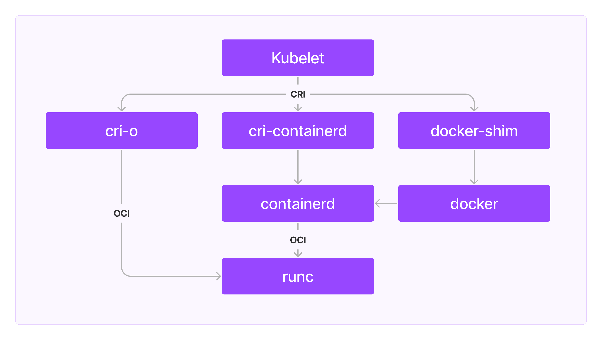

# 国内自建公网 Kubernetes 指南

为什么要自己搭建 Kubernetes：

- Kubernetes 可以轻松部署 cert-manager、istio 等开源工具
- Kubernetes 能提供应用的部署、回滚、健康检查、故障转移等功能
- 云厂商价格太过昂贵
- 公网的 Kubernetes 方便根据云厂商的折扣力度，灵活选择购买哪家的机器

自建 Kubernetes 的问题：

- 为了尽可能节省支出，采用单 Master 节点的部署方式。存在 Kubernetes 主节点崩溃的风险
- 公网的 Kubernetes 部署方案可能存在一定安全隐患
- 采购的廉价机器无法运行需要占用大量资源的应用。
  虽然可以单独购买一台好的机器加入集群。但是价格太过昂贵。

## 价格

既然我们自己搭建 Kubernetes 的主要目的是**省钱**，那么看一下我总共花费了多少钱。

首先，我购买了：

- 一台 2 核 4G 40G 云盘 的阿里云 ECS 作为 Master
- 两台 2 核 4G 60G 云盘 的阿里云 ECS 作为 Worker
- 一台 2 核 2G 60G 云盘 的阿里云 ECS 作为 Gateway(istio ingress)

四台 ECS 均购买了三年，选择同配置下最低价格。总共花费约 6691 元（0.2 元/天）。
对比腾讯云是 2.6 元/小时，而阿里云是 2000+元/月

## Linux 系统选择

我分别在`Centos 7`、`Ubuntu 22`、`Debian 11`尝试搭建 Kubernetes。
最终我选择了`Debian 11`，原因如下：

- `Centos 7`内置的软件包太老了，启动 Kubernetes 需要更新许多软件包。
- `Ubuntu 22`比`Debian 11`系统占用了更多的内存，使用丐版服务器的我们必须节俭。

> 后续内容仅包含在`Debian 11`系统安装 Kubernetes 的方案。
> 不包含在`Centos 7`和`Ubuntu 22`系统安装遇到的问题（`Centos 7`尤其多）。

## 安装 Kubernetes（1.26.9）

Kubernetes 是由许多组件组合而成的系统，每个组件也都有多种不同的选择。
我们先简单了解一下 Kubernetes 的组成。

Kubelete 是 Kubernetesz 中负责管理本机容器、维护容器生命周期的组件。
Kubelete 通过 CRI (Container Runtime Interface 容器运行时接口）创建和管理容器。
主流的实现 CRI 的**高级容器运行时（High Level）工具**有`containerd`（通过 cri-containerd）、`docker`（通过 docker-shim）和`cri-o`等。

不过`containerd`等**高级容器运行时（High Level）工具**通常并不会直接与 Linux 内核交互创建容器，
而是会调用实现了`OCI`（Open COntainer Initiative）规范的**低级容器运行时（Low Level）工具**。

> **高级容器运行时（High Level）工具**相比 **低级容器运行时（Low Level）工具** 实现了镜像管理、gRPC 等高级功能。
> 除了`runc`，还有`runv`、`crun`、`gVisor`等**低级容器运行时（Low Level）工具**。



> `containerd`是 Docker 公司捐赠给 CNCF 的。`runc`也是 Docker 公司捐赠给 OCI 的。

从图中我们可以看到我们有三种搭建 Kubernetes 的方案：

1. `Kubelet` -> `cri-o` -> `runc`
2. `Kubelet` -> `cri-containerd` -> `containerd` -> `runc`
3. `Kubelet` -> `docker-shim` -> `docker` -> `containerd` -> `runc`

我最终选择**方案 2**搭建 Kubernetes。
其一是因为我不熟悉`cri-o`；其二是`docker`会占用大量的系统资源，我们的乞丐服务器扛不住。

接下来，我们需要在所有的宿主机上安装这些软件。

### 安装`runc`

我们可以进入[github opencontainers/runc](https://github.com/opencontainers/runc)下载并安装`runc`。但是由于国内服务器访问 Github 非常不稳定，我们可以通过以下几个手段解决：

- 通过公共 github 代理（例如<https://ghproxy.com>）或者自建的 github 代理下载。
- 将 runc 文件下载后转存如国内的 OSS/COS 等云存储平台

```shell
# 通过github代理下载
REPO=https://ghproxy.com/github.com/opencontainers/runc/releases/download/v1.1.4/runc.amd64
# 通过自己的OSS下载
REPO=https://miaooo-users-service.oss-cn-shanghai.aliyuncs.com/runc.amd64
# 临时存放下载文件的目录
TEMP_FILEPATH=$(mktemp -t runc.amd64.XXXXXX)
# 下载
wget -O ${TEMP_FILEPATH} $REPO
# 安装runc
install -m 755 ${TEMP_FILEPATH} /usr/local/sbin/runc
```

### 安装`containerd`

`containerd`也可以进入[github containerd/containerd](https://github.com/containerd/containerd/tree/main)下载并安装。

```shell
# 通过github代理下载
REPO=https://ghproxy.com/github.com/containerd/containerd/releases/download/v1.6.16/containerd-1.6.16-linux-amd64.tar.gz
# 通过自己的OSS下载
REPO=https://miaooo-users-service.oss-cn-shanghai.aliyuncs.com/containerd-1.6.16-linux-amd64.tar.gz
# 临时存放下载文件的目录
TEMP=$(mktemp -t containerd-1.6.16-linux-amd64.XXXXXX.tar.gz)
# 下载
wget -O ${TEMP} ${REPO}
# 解压/安装
tar xzvf ${TEMP} -C /usr/local
mkdir -p /usr/local/lib/systemd/system
wget -O /usr/local/lib/systemd/system/containerd.service https://ghproxy.com/raw.githubusercontent.com/containerd/containerd/main/containerd.service
systemctl daemon-reload
# 开机启动
systemctl enable --now containerd

# 启用systemd cgroup driver
# https://kubernetes.io/docs/setup/production-environment/container-runtimes/#containerd-systemd
sed -i \
  -e 's/SystemdCgroup\ =\ false/SystemdCgroup\ =\ true/g' \
  /etc/containerd/config.toml
systemctl restart containerd
```

`containerd`的安装并不像`runc`那么简单。
`kubernetes`每次新建`pod`都会创建`pause`容器。用于实现`pod`的多个容器间的资源共享/隔离。
不过`pause`镜像的默认地址（registry.k8s.io/pause:3.7）无法在国内访问，因此我们需要修改成国内的镜像源。

```shell
# 阿里云镜像源
export SANDBOX_IMAGE="registry.aliyuncs.com/google_containers/pause:3.7"
# 修改containerd配置
sed -i \
  -e "/sandbox_image/c\    sandbox_image = \"${SANDBOX_IMAGE}\"" \
  /etc/containerd/config.toml
```

然后，`containerd`默认并没有添加 docker 镜像源，我们需要添加相关配置：

```shell
# 添加docker镜像源配置文件
mkdir -p /etc/containerd/certs.d/docker.io
cat >/etc/containerd/certs.d/docker.io/hosts.toml <<EOF
server = "https://docker.io"
[host."https://registry-1.docker.io"]
  capabilities = ["pull", "resolve"]
EOF

# 将docker镜像源配置文件添加到containerd配置中
sed -i \
  -e 's|config_path\ =.*|config_path = \"\/etc\/containerd\/certs.d\"|g' \
  /etc/containerd/config.toml

systemctl daemon-reload
systemctl restart containerd
```

我们还需要为`containerd`安装`cni`插件：

```shell
# 通过 github 代理下载
REPO=https://ghproxy.com/github.com/containernetworking/plugins/releases/download/v1.2.0/cni-plugins-linux-amd64-v1.2.0.tgz
# 通过自己的OSS下载
REPO=https://miaooo-users-service.oss-cn-shanghai.aliyuncs.com/cni-plugins-linux-amd64-v1.2.0.tgz
# 临时存放下载文件的目录
TEMP=$(mktemp -t cni-plugins-linux-amd64-v1.2.0.XXXXXX.tgz)

# 安装
wget -O ${TEMP} ${REPO}
mkdir -p /opt/cni/bin
tar xzvf ${TEMP} -C /opt/cni/bin
```

> CNI（Container Network Interface）是容器网络接口规范。容器创建时，Kubelet 会通过 CNI 创建网络。容器销毁时也会通过 CNI 销毁网络。

最后，我们需要[转发 IPv4 并让 iptables 看到桥接流量](https://kubernetes.io/docs/setup/production-environment/container-runtimes/#forwarding-ipv4-and-letting-iptables-see-bridged-traffic)。

```shell
cat <<EOF | tee /etc/modules-load.d/k8s.conf
overlay
br_netfilter
EOF

modprobe overlay
modprobe br_netfilter

# 设置所需的 sysctl 参数，参数在重新启动后保持不变
cat <<EOF | tee /etc/sysctl.d/k8s.conf
net.bridge.bridge-nf-call-iptables  = 1
net.bridge.bridge-nf-call-ip6tables = 1
net.ipv4.ip_forward                 = 1
EOF

sysctl --system
```

### 安装 kubelet、kubeadm 和 kubectl 三件套

首先，我们需要禁用交换分区（[为什么](https://discuss.kubernetes.io/t/swap-off-why-is-it-necessary/6879)）：

```shell
sed -i '/ swap / s/^(.*)$/#1/g' /etc/fstab
swapoff -a
```

然后，由于阿里云/腾讯云的服务器并没有绑定公网 IP 的网卡，我们需要创建一个虚拟网卡：

```shell
cat >/etc/network/interfaces.d/ifcfg-eth0:1 <<EOF
auto eth0:1
iface eth0:1 inet static
address ${PUBLIC_IP}
netmask 255.255.255.0
EOF

systemctl restart networking
```

我们还需要开启时钟同步：

> 多台宿主机的时钟不同步会导致 Kubernetes 的证书认证失败

```
apt install -y ntpdate
ntpdate time.windows.com
```

接下来，我们安装 kubelet、kubeadm 和 kubectl。不过由于 kubernetes 官方源在国内无法访问。
我们使用清华源（https://mirrors.tuna.tsinghua.edu.cn/kubernetes/）来安装。

```shell
mkdir -p /etc/apt/sources.list.d
# 清华源没提供gpg，我们从阿里源获取
curl https://mirrors.aliyun.com/kubernetes/apt/doc/apt-key.gpg | apt-key add -
cat >/etc/apt/sources.list.d/kubernetes.list <<EOF
deb https://mirrors.tuna.tsinghua.edu.cn/kubernetes/apt/ kubernetes-xenial main
EOF

apt-get update
apt-get install -y apt-transport-https ca-certificates curl
# 由于K8s集群对不同节点安装的k8s版本差异有严格的限制，建议指定版本安装
# https://kubernetes.io/zh-cn/releases/version-skew-policy/
apt-get install -y kubelet=1.26.9.00 kubeadm=1.26.9-00 kubectl=1.26.9-00
apt-mark hold kubelet kubeadm kubectl

systemctl enable --now kubelet
```

> 为什么不干脆都用阿里源： 清华源的下载速度快。

我们还需要给`kubelet`添加配置，用于指定`pause`镜像的地址：

```shell
export SANDBOX_IMAGE="registry.aliyuncs.com/google_containers/pause:3.7"

cat >/etc/default/kubelet <<EOF
KUBELET_EXTRA_ARGS="--cgroup-driver=systemd --pod-infra-container-image=${SANDBOX_IMAGE}"
EOF
```

由于我们需要将集群搭建在公网，需要给`kubelet`添加配置，使 Kubernetes 启动时绑定在公网 IP 上。

```shell
sed -i "/ExecStart=.\+/{
  s/ --node-ip=$//
  s/$/ --node-ip=${PUBLIC_IP}/
}" /etc/systemd/system/kubelet.service.d/10-kubeadm.conf

systemctl daemon-reload
systemctl restart kubelet
```

一切安装完成后，由于`Debian@11`并未默认开启 cgroups cpu。我们需要添加配置并重启：

```shell
echo 'GRUB_CMDLINE_LINUX="cgroup_enable=cpu"' >>/etc/default/grub
# 此配置重启后才能生效
reboot
```

## 启动 Kubernetes

我们需要先初始化 Master 节点（控制平面），然后再将 Worker 节点添加到 Kubernetes 集群中

### Master（Control Panel）

我们先登入 Master ECS，初始化 Kubernetes：

```shell
# 除了pause镜像，启动kubernetes还需要一些其他的镜像
# 我们这里也是用阿里云的镜像源
export IMAGE_REGISTRY="registry.aliyuncs.com/google_containers"

kubeadm init \
  # 设置公网IP
  --apiserver-advertise-address=$PUBLIC_IP \
  # 虽然我们目前只有一个Master节点
  # 但是如果某一天我们有钱了，需要扩展成高可用集群
  # 则必须提前添加--control-plane-endpoint
  # 否则你只能选择重建一个新高可用集群
  --control-plane-endpoint=$CONTROL_PLANE_ENDPOINT \
  --image-repository=$IMAGE_REGISTRY \
  # 请务必设置--service-cidr和--pod-network-cidr
  # 后面配置网络需要用到
  --service-cidr=10.96.0.0/12 \
  --pod-network-cidr=10.244.0.0/16 \
  --upload-certs
```

然后为 kubectl 添加配置

> kubectl 是管理 Kubernetes 集群的命令行工具。
> 不添加配置无法管理集群，即便是安装在同一台宿主机上。

```shell
mkdir -p $HOME/.kube
cp -f /etc/kubernetes/admin.conf $HOME/.kube/config
chown $(id -u):$(id -g) $HOME/.kube/config
```

生成 Worker 节点加入集群的指令：

```shell
kubeadm token create --print-join-command
```

### Worker（Node）

登入每一台 Worker ECS，执行加入集群的指令：

```shell
kubeadm join xxxxxxxxx:6443 --token xxxxxxx --discovery-token-ca-cert-hash xxxxxxx
```

### 安装 Kubernetes 网络插件

集群启动后，我们会发现不同节点直接无法通信，也无法获取其他节点的状态信息。
这时我们就需要安装 Kubernetes 的网络插件。

Kubernetes 网络插件主要用于解决**容器的跨主机通信问题**。
它有`flannel`、`calico`、`weave`、`canal`等许多选择。
我选择了最简单并容易安装的`kube-flannel`：

> 为什么选择`kube-flannel`：其他几个网络插件安装太过于繁琐，并且 flannel 的缺陷并不会出现在一个如此小的集群中。

```shell
# 新建一个存放yaml配置的文件
mkdir -p ~/kube-flannel
FILE=~/kube-flannel/kube-flannel.yml
# 下载官方提供的默认配置文件
REPO=https://ghproxy.com/https://github.com/flannel-io/flannel/releases/latest/download/kube-flannel.yml
wget -O $FILE $REPO
# 添加公网IP配置
sed -i \
  -e '/--ip-masq/i\        - --public-ip=$(PUBLIC_IP)' \
  -e "/--ip-masq/i\        - --iface=eth0" \
  -e "/- name: POD_NAME$/i\\
        - name: PUBLIC_IP\\
          valueFrom:\\
            fieldRef:\\
              fieldPath: status.podIP" \
  $FILE
# 部署 kube-flannel
kubectl apply -f $FILE
```

至此，我们的 Kubernetes 集群终于搭建完成了。为了方便以后添加新的服务器（ECS），我将这些`shell`脚本整理到 [**Github 仓库**](https://github.com/Val-istar-Guo/cluster-utils)。如果这篇文章对你有帮助，请为这个仓库点个 **Star**。如果对我后续的项目感兴趣，可以 **Fllow** 我的[Github 账户](https://github.com/Val-istar-Guo)。
