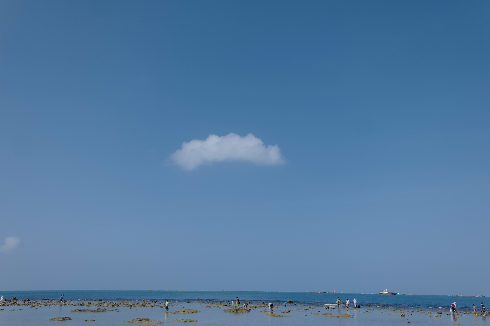

# 2024 年度总结

2024 年是充满波折的一年，我开始质疑自己的工作，并决定去走一条任性的路。
2024 年是走的最远的一年，与我爱人走过了三亚、云南和东北。
2024 年也不乏趣事，认识了志同道合的朋友、也发现了一个新的爱好。

## 工作/前程

### 绩效 C

2024 年初，当我得知上一年度综合绩效为 C 时，我即非常的不服气也非常的无奈。
不服气是，我得知绩效的考核标准是按照 **加班时长** 和 **业务满意度** 这两个临时确定的指标评选的，这让我一年的努力看上去像是牺牲品一样。
无奈的是，即便我知道这一切也无法改变什么，我不得不接受自己变成了一个垫脚石。

> [!TIP]
>
> 绩效分为 A/B/C/D 四级，在没有犯错的情况下，C 是最低绩效。

这直接导致了我原计划用前两年时间积累的业务成果去晋升的计划功亏一篑。而我更不能接受的是用 C 来否定我一年的努力的工作成果，这成了我内心的一根刺。
于是在年初我便开始准备找工作。

### 想做什么

当我重新审视自己时，发现我已经不仅仅是一个前端工程师了，也是一个后端开发工程师，还是一个产品经理。
我给自己打上了全栈的标签开始面试。这一切本来进行的不温不火，我不想离开南京，也没有多少选择，直到....我遇到了一位公司的 CTO。

他是一个有趣又随和的人，我们从线上聊至线下，在聊天中，他告诉我现在应该去想想以后想做什么，是去继续深耕某个技术领域？抑或是加入一个初创公司搏一搏。
而我一直都没有对于自己的职业规划，也从未打算做出什么规划，就是努力的将别人给我的项目做的优秀、同时学习更多的新知识，周而复始。
而这样简单快乐的生活却被两个指标轻易的破坏了。

不知是他有意还是无意，评价我说，我现在的能力非常适合初创公司。
**“嘭”**，这句话让我想起了许多往事，
我曾哭着喊着跟我爸讲我要去做搞事情，
我曾羡慕着登上财经频道的百度说每个员工生日的时候都会送蛋糕（那时我还是小学生），
还有会想起那年在大学卖芒果的日子是那么快乐。
在南京这个小地方，真的很难找到适合我的工作，而我又离不开这里，因为我离不开我可爱又漂亮的老婆。
既然我那么讨厌现在的制度，又对自己的能力充满自信，为何不坚定的去创造我的乌托邦呢。**失败又如何，至少不后悔，也不需要虚伪。**

### 工作是工作，生活是生活

感谢他之后，我开始不在主动的去找新工作了，我也没有辞职，因为需要这份工作维持生命体征，我也没有积极响应加班，因为不应该将更多宝贵的时间浪费在维持生命体征上。
工作就是工作，做完就好，这让能够去坦然的接受下一个 C。
生活就是生活，在业余的时间里，我申请创办了一家名为 Buka 的公司，名字是老婆起的，调皮又可爱，我非常喜欢。
我开始每天晚上学习和写代码，将 Github 的贡献图放在手机屏幕上以鼓励自己。我在很长的一段时间，都没有志同道合的朋友，很孤独，但幸好还有老婆陪着我。

这一年，我搭建好了 Kubernetes 微型集群用于项目部署，也建设了较为完善的 DevOps 流水线。
我没有急切地去尝试新业务，因为我想要走的稳一点，想要走的越来越快。我认为基础要做的扎实，业务才能做的快。
我不认为自己会一次就成功，所以应该打好基础，减少一次次试错的成本。2024 这一年，是我建设基础设施的一年。

[Blog]: https://val-istar-guo.com

> [《国内自建 Kubernetes 指南》](https://val-istar-guo.com/articles/%E5%9B%BD%E5%86%85%E8%87%AA%E5%BB%BAKubernetes%E6%8C%87%E5%8D%97)、[《国内 Kubernetes(1.28.2)集群部署 OpenEBS(3.10.0)》](<https://val-istar-guo.com/articles/%E5%9B%BD%E5%86%85Kubernetes(1.28.2)%E9%9B%86%E7%BE%A4%E9%83%A8%E7%BD%B2OpenEBS(3.10.0)>)、[《搭建在 wireguard 上的 kubernetes》](https://val-istar-guo.com/articles/%E6%90%AD%E5%BB%BA%E5%9C%A8wireguard%E4%B8%8A%E7%9A%84kubernetes) 都是 2024 年的成果
>
> [Blog][Blog] 也在今年重新上线，成为第一个发布的服务。[Blog][Blog] 的试水也让我决定彻底放弃 PWA，转向学习 Flutter。

### 年末小惊喜

到了 2024 年底，我迎来了第一个小伙伴的加入。我们于桌游社相识，又恰好聊起了 Kubernetes。他的加入帮我进一步完善了 Kubernetes 集群。我们也一起开始了我们的第一个小项目，这也是一个藏在我心里许久的项目。
除此之外，我还将我随手写的一个工具挂到了咸鱼，竟然赚到了 17 块钱，还有人续费，这令我非常惊喜。这似乎是一个很好的开始，虽然这些钱只够买一杯咖啡的。

## 旅行

我老婆是个热爱旅行的人，2024 年初正巧父母去三亚度假，我俩过年去蹭吃蹭喝了一周，搞坏了一辆电动车，还晒黑了皮。

五一又去了云南，被机票宰了后才知道，云南旅游的人数今年少了非常多。只可惜没有看到泸沽湖的繁星，非常遗憾。

年末，我们又去了
