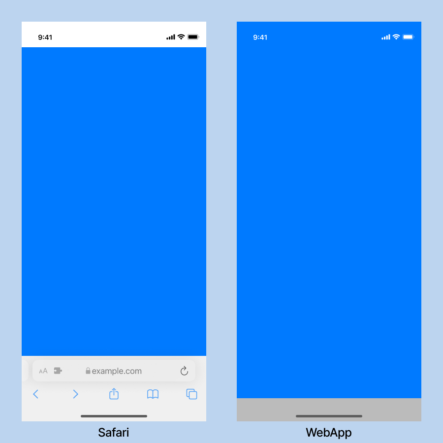
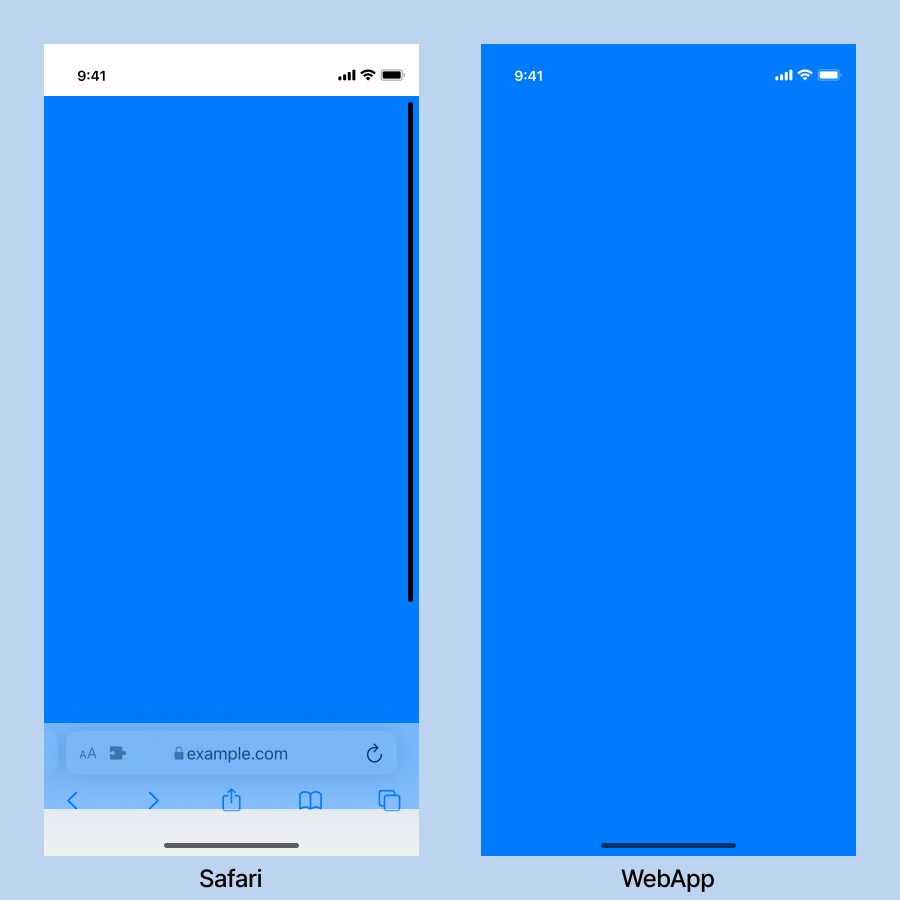

# Ios 的 100vh 问题解决方案

让我们先复现一下问题。
准备一个支持 PWA 的移动端网站。为方便演示，我们编写了一个简单的网页：

```html
<html>
  <head>
    <meta
      name="viewport"
      content="width=device-width, initial-scale=1,viewport-fit=cover"
    />
    <meta name="theme-color" content="#fff" />
    <meta name="apple-mobile-web-app-capable" content="yes" />
    <meta name="apple-touch-fullscreen" content="yes" />
    <meta
      name="apple-mobile-web-app-status-bar-style"
      content="black-translucent"
    />
  </head>

  <!-- body 深灰色  -->
  <body style="background: #9D9D9D">
    <!-- div 天蓝色 -->
    <div style="height: 100%; background: #007AFF" />
  </body>
</html>
```

我们也为网站添加一份`manifest.json`，从而允许网站添加到桌面。我们之后将添加到桌面的网页称之为`WebApp`：

```json5
{
  // ...其他属性
  display: "fullscreen",
}
```

如果将`html`、`body`均设置为`100%`高度，在 safari 中不会出现问题，但是 WebApp 会发现`div`无法占满全屏，底部缺失了`env(safe-area-inset-bottom)`高度。

```html
<html style="height: 100%">
  <head>
    <!-- 省略 -->
  </head>

  <body style="height: 100%; background: #9D9D9D">
    <div style="height: 100%; background: #007AFF" />
  </body>
</html>
```



如果将`body`设置为`100vh`高度，在 WebApp 中不会存在问题，但是在 safari 中会出现滚动条。

```html
<html>
  <head>
    <!-- 省略 -->
  </head>

  <body style="height: 100vh; background: #9D9D9D">
    <div style="height: 100%; background: #007AFF" />
  </body>
</html>
```



## 解决方案

### `webkit-fill-available`

我最开始也查找了不少资料，主要的解决方案使用过`-webkit-fill-available`自动填满剩余高度来解决。

```css
@supports (-webkit-touch-callout: none) {
  body {
    height: -webkit-fill-available`;
  }
}
```

这个方案也是[postcss-100vh-fix](https://github.com/postcss/postcss-100vh-fix)插件的解决方案。

如果我们不是将`apple-mobile-web-app-status-bar-style`设置为`black-translucent`，在`manifest.json`中添加了`"display": "fullscreen"`并且我们还有一个**有刘海的苹果手机**。那么一切都将像我们预期一样。

然而我手上恰好有一个刘海屏的苹果手机。

### 另一种解决方案

其实当我们发现，在 safari 中`100%`能够正常运行，在 WebApp 中`100vh`能够正常运行时。我们其实已经找到了一个新的解决方案：

1. 判断当前运行环境是 WebApp 还是 Safari。
1. 当运行环境是 WebApp 时，设置`100vh`。
1. 当运行环境是 Safari 时，设置`100%`。

```javascript
// https://val-istar-guo.com/script/fix-100vh.js
if (document) {
  // window.navigator.standalone 判断是否是ios的WebApp
  if (window.navigator.standalone) {
    // WebApp下需要设定100vh才能获取到正确的高度
    const styles = `html, body { height: 100vh; }`;
    const styleSheet = document.createElement("style");
    styleSheet.innerText = styles;
    document.head.appendChild(styleSheet);
  } else {
    // 非WebApp下需要设定100%才能获取到正确的高度
    // 设定100vh在ios下会导致页面出现滚动条
    const styles = `html, body { height: 100%; }`;
    const styleSheet = document.createElement("style");
    styleSheet.innerText = styles;
    document.head.appendChild(styleSheet);
  }
}
```

我们将这个文件加入 html 文件的 head 中：

```html
<html>
  <head>
    <meta
      name="viewport"
      content="width=device-width, initial-scale=1,viewport-fit=cover"
    />
    <meta name="theme-color" content="#fff" />
    <meta name="apple-mobile-web-app-capable" content="yes" />
    <meta name="apple-touch-fullscreen" content="yes" />
    <meta
      name="apple-mobile-web-app-status-bar-style"
      content="black-translucent"
    />

    <!-- 在浏览器渲染前添加修复100vh问题的css -->
    <script src="https://val-istar-guo.com/script/fix-100vh.js"></script>
  </head>

  <body style="background: #9D9D9D">
    <div style="height: 100%; background: #007AFF" />
  </body>
</html>
```

这样，我们就彻底解决了 ios 系统的 100vh 问题。

> 如果需要`min-height`，可以直接修改`fix-100vh.js`脚本。
