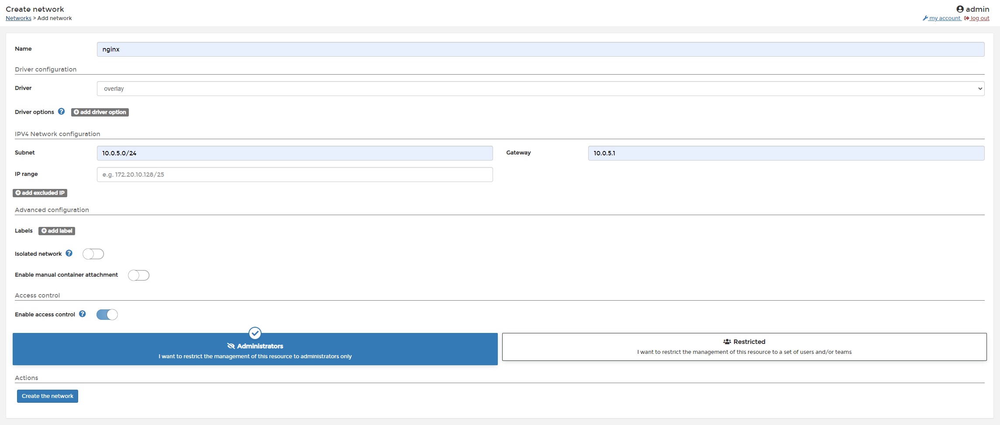
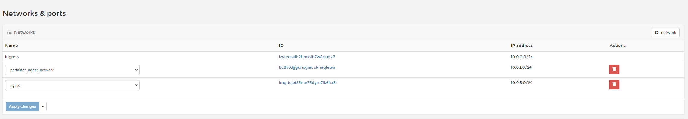
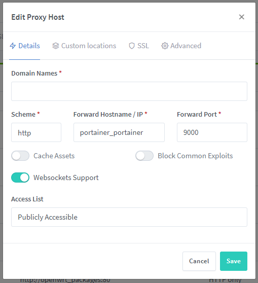
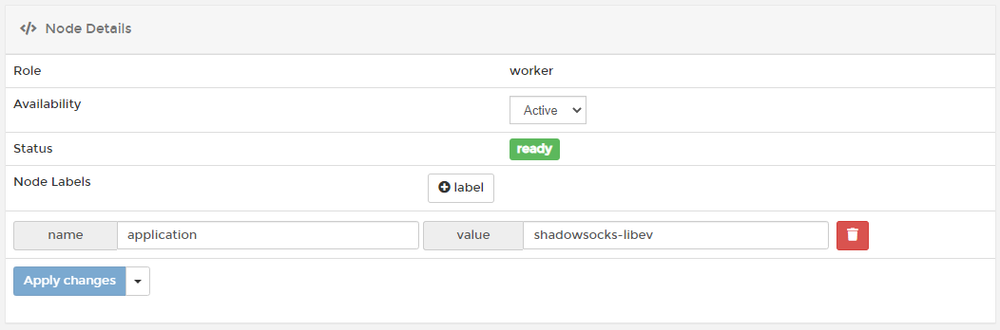
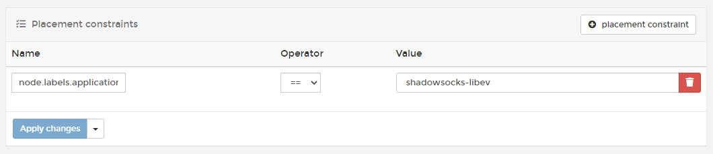

# 一个人的运维

[Docker]: https://www.docker.com
[Docker Swarm]: https://docs.docker.com/engine/swarm/
[Docker Compose]: https://docs.docker.com/compose/
[Portainer]: https://www.portainer.io
[Kubernetes]: https://kubernetes.io/
[Nginx Proxy Manager]: https://nginxproxymanager.com/

## 价值

- 充分利用各种开源服务，大大降低个人的研发成本
- 快速部署服务
- 省钱
  - 可以尽可能选择性价比高的服务器作为集群的节点。还可以随时更换节点，而不影响部署在其中的服务。
  - 一键暂停暂时不需要的服务。可以减少按照 CPU 占用来计费的服务节点费用。
- 图形化操作
  - 服务快速扩容
  - 服务启停
  - 服务更新
  - 服务回滚

## 技术选型

- [Docker][Docker]

  [Docker][Docker] 可以让开发者打包他们的应用以及依赖包到一个轻量级、可移植的容器中，然后发布到任何流行的 Linux 机器上，也可以实现虚拟化。
  很多开源服务都在[Docker Hub](https://hub.docker.com/)提供镜像供我们使用。我们也需要将自己开发的服务打包成 docker 镜像。

- [Docker Swarm][Docker Swarm]

  [Docker Swarm][Docker Swarm] 是 [Docker][Docker] 的集群管理工具。它将 [Docker][Docker] 主机池转变为单个虚拟 [Docker][Docker] 主机。
  [Kubernetes][Kubernetes] 同样是容器编排工具，但是 [Docker Swarm][Docker Swarm] 安装和使用更加简单且对服务器性能要求更低。
  因此也成为搭建个人集群的首选。

- [Portainer][Portainer]

  [Portainer][Portainer] 是集群的可视化管理工具。同时支持[Docker Swarm][Docker Swarm]与[Kubernetes][Kubernetes]的商业软件。
  提供的免费版本完全足够个人运维使用。

## 知识储备

- 熟悉 Linux
- 熟悉[Docker][Docker]
- 熟悉[Docker Compose](https://docs.docker.com/compose/)
- 了解[Docker Swarm]、容器编排、集群等基本概念。

## 设备选购

- 阿里云 ECS 服务器

  根据个人需要选择型号。我们需要至少一台 ECS 作为主节点。选择阿里云的 ECS 主要是因为使用起来感觉比较稳定，不容易出现一些莫名奇妙的问题。追其根本，是因为国内的供应商都在服务器的 Linux 镜像上动了不少手脚。

  根据需要，我们可以再选购一些工作节点。这里建议可以选择“抢占式实例”。一是便宜；二是可以随时退掉实例再购买新实例，如果大家想购买海外实例部署些什么不可描述的服务，那可是太方便了。尤其是移除实例再添加实例后，服务会自动的部署和启动，省下我们不少功夫。

## 安装 Docker

不同 Linux 的安装方式稍有不同。[Docker][Docker]提供了详细的[安装文档](https://docs.docker.com/engine/install/)。

## 创建 Swarm 集群管理节点

```shell
docker swarm init --advertise-addr $ADVERTISE_ADDR --data-path-port $DATA_PATH_PORT
```

- `$ADVERTISE_ADDR`

  节点的 IP 地址，阿里云中这个 IP 默认是内网 IP。如果工作节点处于其他服务商，则需要更换成公网 IP

- `$DATA_PATH_PORT`

  覆盖网络流量使用的 UDP 接口。默认使用 4789 端口，但是由于在阿里云中：

  > UDP 监听的 250、4789 和 4790 三个端口为系统保留端口，暂时不对外开放。

  这导致使用阿里云的 ECS 服务器作为集群节点必须修改此端口，否则添加工作节点后，工作节点上部署的服务会出现异常。

## 部署 Portainer

[Portainer][Portainer] 作为一个商业软件，有着非常详细的[部署文档](https://documentation.portainer.io/v2.0/deploy/ceinstallswarm/)。
部署方式如下：

```shell
curl -L https://downloads.portainer.io/portainer-agent-stack.yml -o portainer-agent-stack.yml

docker stack deploy -c portainer-agent-stack.yml portainer
```

[Portainer][Portainer] 管理网站页面默认绑定到 9000 端口。访问`http://your_server_host:9000`便可进入管理页面。
建议先体验以下管理界面，在继续部署后续的服务。

## Portainer 应用模板

[Docker Compose][Docker Compose] 可以定义和运行多容器 Docker 应用程序。[Portainer 应用模板](https://documentation.portainer.io/v2.0/settings/apps/)可以将`docker-compose.yml`作为模板，随时一键部署应用。Portainer 也提供了详细的[说明文档]()。也可以参考我的[Portainer 模板](https://github.com/Val-istar-Guo/portainer-templates)。

## 部署 Nginx 代理

通过 IP 来访问 Portainer 管理页面不方便也不安全。部署一个 Nginx 服务并且设置强制 Https 访问，能够提高我们网站的安全性。

[Nginx Proxy Manager][Nginx Proxy Manager]是一个非常不错的开源的 Nginx 可视化管理服务。官方网站也提供了完整的部署方法与`docker-compose.yml`。

部署完成后，我们需要将所有的服务与[Nginx Proxy Manager][Nginx Proxy Manager]连接入同一个[Network](https://docs.docker.com/network/overlay/)。首先我们进入[Portainer][Portainer]创建一个新的 Network：



然后我们需要将所有服务都添加到新的 Network：



最后，我们进入[Nginx Proxy Manager][Nginx Proxy Manager]添加配置：



> 在同一个 Network 中的服务可以通过服务的 Service Name 访问其他服务。

最后我们只需要将域名解析服务商的解析值指向[Nginx Proxy Manager][Nginx Proxy Manager]即可。

## 添加工作节点

有些服务需要部署在固定的集群节点上才能正常运行，例如某些不可描述的网络代理服务。
首先我们要准备一个海外的 ECS 服务器。在其上安装好 Docker，然后将其加入到集群中作为工作节点：

```shell
docker swarm join --token $TOKEN $ADVERTISE_ADDR
```

- `$ADVERTISE_ADDR`

  管理节点的地址，格式：$IP:$HOST

- `$TOKEN`

  管理节点的 Token，需要进入管理节点获取

添加好节点后，进入[Portainer][Portainer]可以给节点添加 Label：



然后在部署服务时，配置服务必须在具备此 Label 的节点上部署：



此服务会自动的部署在有此`Label`工作节点之上。当此工作节点无法使用的时候，删除此节点再添加一个新的节点并设定好 Label，集群会自动的将服务从旧的节点移至新的节点上。

至此，我们便部署好了一个可视化应用运维工具。
